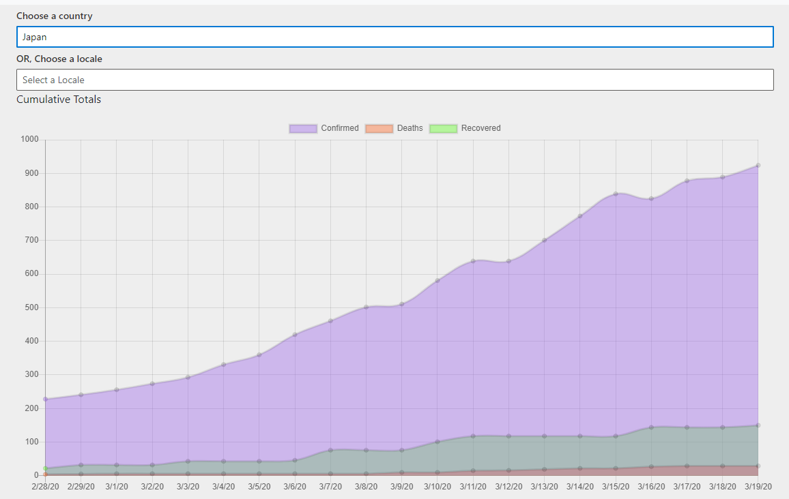

# covid-dashboard

This web application shows day-to-day Corona BVirus infection rates. It reads data directly from the CSV files in https://github.com/CSSEGISandData/COVID-19

## Setup

1. .NET Cora SDK 3.1
2. react-scripts 3.4
3. I used Visual Studio 2019 to develop

